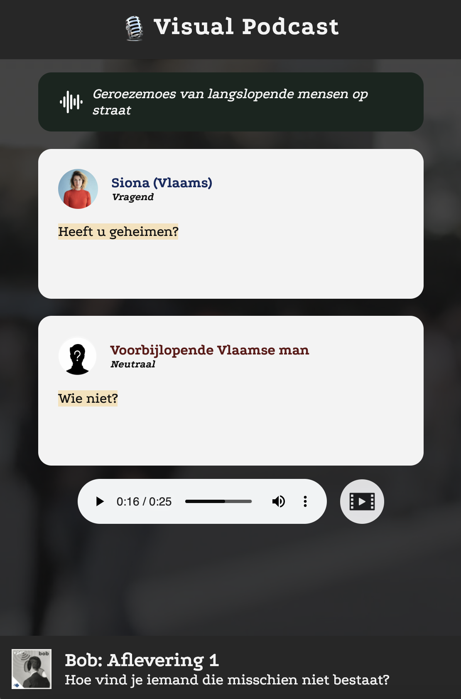
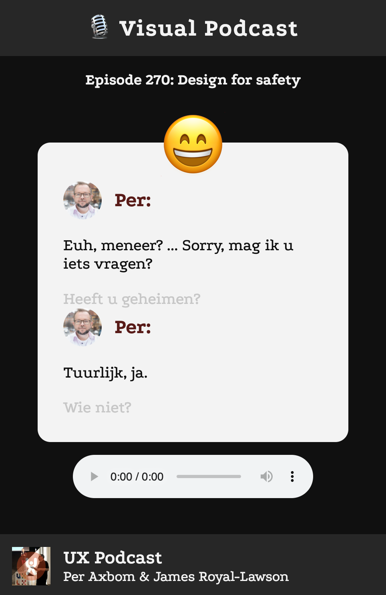
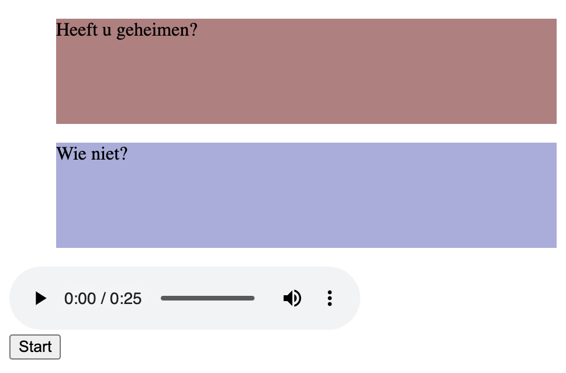
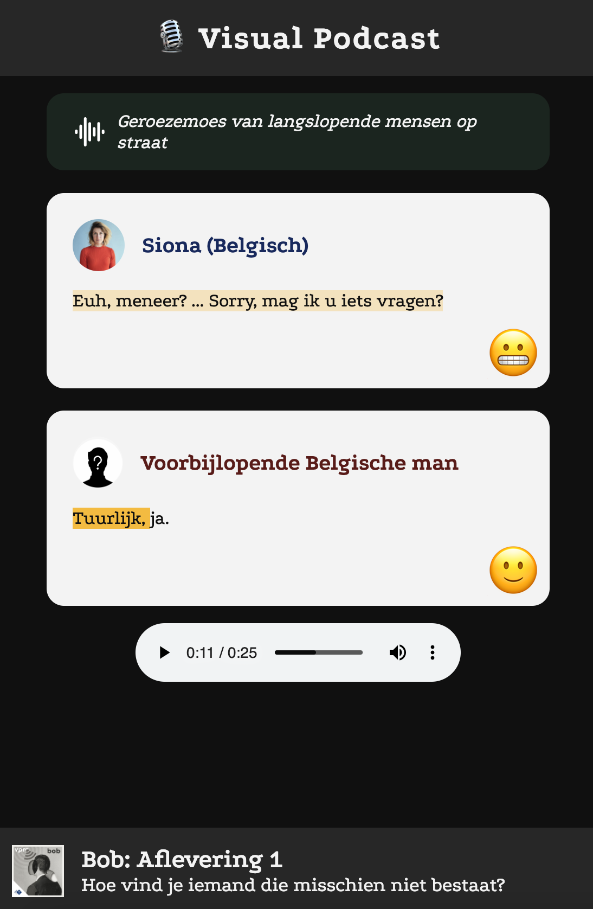
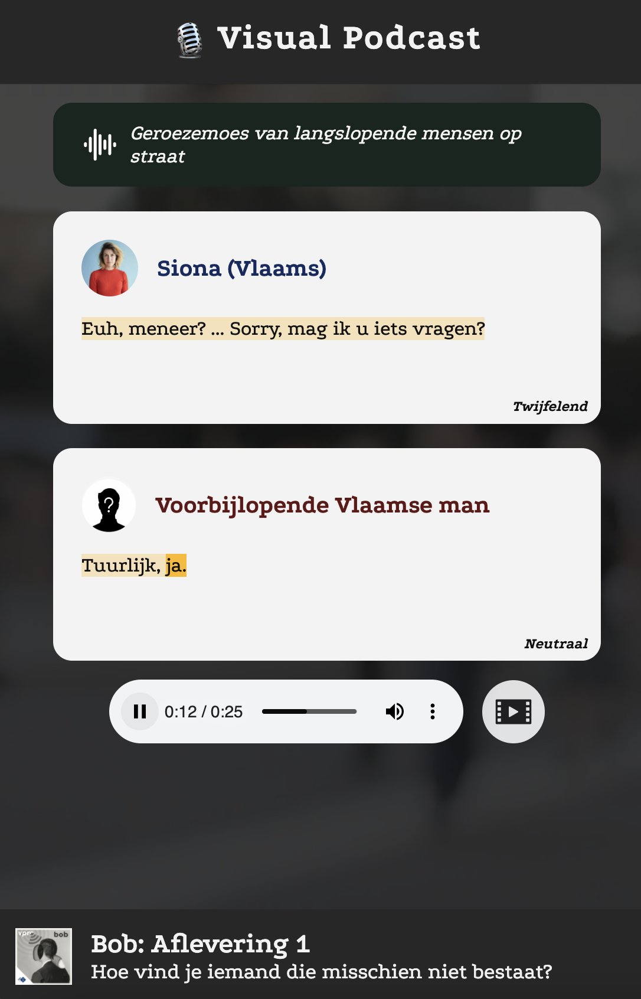
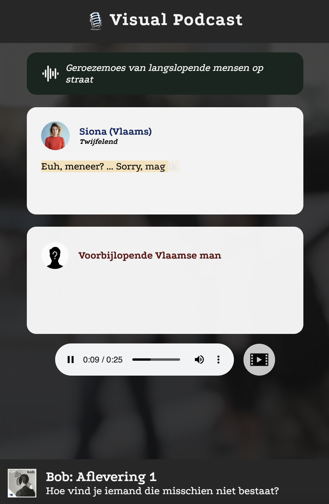

# 

## Table of contents
  - [About](#about)
  - [Features](#features)
  - [Client & server side rendering](#Client--server-side-rendering)
  - [Job Stories - Service Worker](#Job-Stories---Service-Worker)
  - [Activity Diagram](#Activity-Diagram)
  - [Critical render path](#Critical-render-path)
  - [API documentation](#API-documentation)
  - [Installing](#installing)
  - [Author](#author)
  - [To-do](#To-do)
  - [Contributing](#contributing)
  - [License](#license)

## [Live demo Visual Podcast()



## Features
|                                                                   |     |
| ----------------------------------------------------------------- | --- |
| 💬  Podcast transcriptie, maar dan goed                            | ✔   |
| ⏱️  Timing functionaliteit van spreker                            | ✔   |
| ✨  Extra sfeer & emotie herkenning                               | ✔   |


## De opdracht
**Voor het project Human Centered Design maakte ik een applicatie voor een écht mens. Marie van Driessche is Doof, met een hoofdletter, dat betekent dat ze zichzelf als Doof identificeert, wat simpelgezegd betekent dat haar eerste taal Nederlandse Gebarentaal is. Marie is doof geboren, maar dat laat haar niet zomaar stoppen. Ze werkt voor de VPRO als interaction designer op het gebied van toegankelijkheid en probeert haar leven zo gewoon mogelijk te leven.**

Maar leven met een auditieve beperking blijft uiteraard lastig in sommige situaties. Hoe ervaar je bijvoorbeeld een podcast als je doof bent? Bij deze tekstuele vertalingen gaat veel nuance verloren. Hoe wordt iets gezegd? Is het sarcastisch? Wat voor achtergrond geluiden zijn er allemaal?

Aan mij de taak om een interactieve oplossing te bedenken en te prototypen voor Marie. Zodat zij op dezelfde manier een podcast kan ervaren.

## User Scenario
De persoon waar ik een ontwerp voor mag maken is Marie van Driessche. 

Marie is al haar hele leven doof, daarom praat ze in gebarentaal. Ze is interaction designer op het gebied van toegankelijkheid bij de VPRO. Ze houdt van koken, wijn drinken en kitesurfen. (Niet tegelijk hoop ik). 

Door Marie haar auditieve beperking kan zij niet zomaar een podcast luisteren. Van sommige podcasts zijn transcripties, maar dat is platte tekst en voelt niet fijn om te lezen. Ook mist de nuance in deze transcripties. De sfeer en manier van vertellen moet zij zelf invullen, dat wordt niet vormgegeven.

Marie wilt (zo veel mogelijk) op de zelfde manier een podcast kunnen ervaren als mensen met een goed gehoor. Zodat ze de dynamiek, timing, sfeer, nuance en (achtergrond)geluiden ook mee krijgt. In plaats van kale tekst. 

Zo wordt het voor haar leuker en intressanter om een podcast te ervaren, omdat ze dan beter haar aandacht erbij houdt en een volledig beeld krijgt van hoe het gesprek verliep. Al die elementen zijn namelijk precies wat voor mensen met goed gehoor een podcast zo leuk maakt. 

Marie zal de applicatie niet op dezelfde manier gebruiken zoals goed horende podcast luisteraars. Ze zal het vaak op de bank of in bed gaan lezen, omdat zij niet tijdens het inruimen van de vaatwasser kan luisteren naar het gesprek. De applicatie zal dan ook vooral op mobiel goed moeten werken.

## Prototype 1
Als eerste prototype had ik snel een opzet gemaakt van het concept. Nog niet interactief, want we hadden maar 3 uur voordat Marie kwam voor de eerste test. 

Het concept is **'Visual Podcast'**. In het eerste prototype van Visual Podcast kun je een podcast aanzetten en wordt het gesprek omgezet in tekst blokken. In deze tekst blokken staat wie er aan het praten is met een foto. Zo krijg je een beter beeld als slecht horende wie wat zegt.

Ook is er bovenaan het transcript een emoji te zien, deze emoji geeft de sfeer en nuance weer van het gesprek. Deze emoji verandert dus mee met het gesprek.



### Testen met Marie | Week 1
De eerste keer testen met Marie was bijzonder. Aangezien Marie doof is had ze 2 tolken bij zich. Het testen is dan ook anders dan ik gewend was, omdat ik moest wennen aan het praten via een tolk. Uiteindelijk ging het best goed.

Ik wilde testen bij Marie wat ze vond van de Emoji die de nuance en sfeer aan zou moeten geven. Ook was ik benieuwd wat ze van de algemene opzet vond qua vormgeving en concept.

Marie gaf aan dat ze de emoji te ver van de tekst vandaan vond staan. Ze vertelde, via de tolk, dat ze nu de hele tijd weg moet kijken van de tekst om de emoji te kunnen zien. Goed punt.

Wat betreft de vormgeving en het concept vond ze het nice! Niet zoveel op aan te merken en gaf haar duidelijk aan welke podcast ze luisterde. 

Wel gaf Marie nog aan dat ze nu niet kan zien wanneer een spreker iets zegt. De timing van het gesprek is van belang om je beter voor te kunnen stellen hoe het gezegd zou zijn.

## Prototype 2
Aangezien Marie aangaf dat ze de timing wilt volgen van de spreker twijfelde ik wat slim was om te doen. Er is namelijk nog geen goede JavaScript transcript timing functionaliteit. 
Om deze zelf te maken zou veel tijd kosten, maar als ik de functionaliteit eenmaal had, zou het prototypen erg snel gaan. 

Ik kon ook de tekst in Adobe Premiere Pro animeren. Dat zou veel sneller zijn, maar niet op het web. Waardoor je alles handmatig zou moeten blijven aanpassen.

Ik heb uiteindelijk gekozen om de timing functionaliteit te gaan proberen te bouwen in code. Dit lukte na een lange dag coderen in dit simpele prototype. 



## Prototype 3
In prototype 3 heb ik prototype 1 en 2 samengevoegd. De timing functionaliteit om te zien wanneer de spreker een woord zegt werkt nu volledig in het ontwerp van prototype 1.

Naast dat ik de emoji's dichterbij de tekst heb gezet, zoals Marie aangaf, heb ik 't ook nog een persoonlijke *touch* gegeven.

Ook heb ik een apart blokje gemaakt voor achtergrond geluid. Hierin wordt beschreven welke andere geluiden er te horen zijn naast het lopende gesprek.

Marie werkt bij de VPRO, dus ik heb daarom de podcast Bob van de VPRO gekozen. Ik hoopte dat ze er misschien van gehoord zou hebben en dat ze dan mee zou kunnen praten met haar collega's.

Persoonlijke elementen zijn namelijk erg belangrijk bij [exclusive design](#exclusive-design)



### Testen met Marie | Week 2
Tijdens het testen met prototype 3 was ik natuurlijk vooral benieuwd of Marie de highlight timing functionaliteit prettig vond. Ook wilde ik weten wat ze van de emoties in de tekstblokken vond. Zo ook van de achtergrond geluiden beschrijving.

Marie liet tijdens het testen weten dat ze al erg blij was met deze versie. Wel had ze een paar opmerkingen tijdens het testen:

- De achtergrond geluiden beschrijving was fijn
- De highlight timing was al een prettige verbetering.
- Ze twijfelde over de emoji's. Deze betekenen voor iedereen namelijk weer iets anders. Ze vertelde daarom dat een beschrijvend woord van de nuance misschien beter zou zijn. Zoals *'verbaasd'*. 

Naar aanleiding van haar opmerking over emoji's, vroeg ik of ze het misschien meer in een lopende zin zou willen lezen. Zoals: *"Dat weet ik niet", zei hij verbaasd.*. Dat wilde ze niet. 1 woord is genoeg, omdat ze anders alleen maar meer moet lezen, waar ze geen zin in heeft.

Wat betreft de podcast van VPRO voor wat persoonlijke *touch*: Marie herkende inderdaad de podcast en de makers ervan. Dat vond ze erg leuk!

Als laatste vroeg ik haar wat ze er van zou vinden als er in de achtergrond een video zou afspelen van een soort gelijke locatie waar het gesprek zich bevindt. Dat leek haar opzich een goed idee, als het niet te veel zou gaan afleiden.

## Prototype 4
Zoals overlegd, had ik de achtergrond video in prototype 4 toegevoegd. Dit geeft meer sfeer en context over het gesprek.
Rechts van de audio controls heb ik ook een video knop toegevoegd om de achtergrond video uit te kunnen zetten, als dit te veek afleidt. 

Ook had ik de emoji's vervangen met een beschrijvend woord.



### Testen met Marie | Week 3
De laatste keer testen met Marie. Ze herkende inmiddels de applicatie en was benieuwd naar de achtergrondvideo. Deze vond ze erg fijn, omdat het goed bijdraagt aan de sfeer.
Ze vond het mooi subtiel en niet afleidend.

Marie vond de oplossing van de emoji's vervangen met een woord goed, maar nu staat het woord rechts onder het tekstblok. Daardoor las ze eerder de tekst en daarna pas de nuance. Deze zou beter boven de lopende tekst kunnen staan.

Ook had Marie nog een laatste opmerking over de timing functionaliteit. In dit prototype worden de woorden alleen gehighlight als deze gesproken worden. De hele zin staat al in beeld. Marie vertelde dat ze nu soms sneller leest dan de highlight. Het leek haar tof als de woorden pas in beeld komen als ze verteld worden.

## Laatste iteratie
Op basis van Marie haar laatste feedback is dit de laatste iteratie geworden:



Je kunt ook de [live-versie bekijken]( .

## Exclusive Design
Exclusive Design is het tegenover gestelde van Inclusive Design. Normaal ontwerpen we site's en apps die voor zoveel mogelijk mensen te gebruiken is. Bij exclusive design focus je juist helemaal op 1 persoon. Een ontwerp wat helemaal afgestemd is op 1 iemand. 

Exclusive Design kun je opdelen in 4 elementen:

### 1. Study situation
Door heel specifiek te kijken naar de situatie van 1 persoon, ga je pas echt begrijpen wat diegene nodig heeft.

Bij Marie weet je dat ze doof is en dat ze dus tekst nodig heeft in plaats van audio. Maar door haar vragen te stellen en haar context te onderzoeken, kom je er pas achter dat ze meer nodig heeft. Dat ze nuances mist en geen sfeer en emotie voelt zoals goed horende dat meteen horen bij audio.

Door specifiek Marie haar situatie uit te pluizen kom je op betere oplossingen, wat leidt tot een fijnere ervaring voor haar.

### 2. Ignore conventions
Een menu staat bovenaan, scrollen doen we van boven naar beneden. Patronen in het web zijn handig, zodat je snel een interface begrijpt, maar mensen met een beperking hebben soms juist last van zo'n patroon. 

Visual podcast is dan ook geen normaal standaard transcript maar specifiek aangepast naar Marie haar voorkeuren.

### 3. Prioritise identity
Door Marie haar persoonlijkheid en voorkeuren terug te laten komen in het ontwerp, zal zij dit ontwerp sneller gebruiken. Je zelf ergens in herkennen en prettig bij voelen is al snel fijn. 

Ik heb daarom gekozen voor de podcast Bob van VPRO. Marie werkt bij de VPRO. Ze kent de collega's die daar aan hebben gewerkt, zo heeft ze al een connectie met de podcast en kan ze op haar werk meepraten over de podcast.

### 4. Add nonsense
Een site moet functioneel zijn. Maar als het eenmaal werkt, wordt het snel saai als je niks leuks toevoegd. Waarom zou je je bezoekers niet met een glimlach laten rondstruinen op je applicatie? 

Ik heb daarom een kleine easter-egg toegevoegd voor Marie. Als de podcast toch wat saai of niet intressant is, kan ze op het microfoontje klikken in de header, voor een leuk animatie effect.


## Conclusie
Waarom uiteindelijke oplossing werkt
In de uiteindelijke versie van Visual Podcast kan Marie mee lezen op het ritme van de spreker, maar kan ze dit ritme ook versnellen, zoals ze dat gewend is van YouTube video's.

Door de achtergrond video, beschrijving van geluiden en de nunace die de intentie van de spreker uitlegd, is het gesprek voor Marie aanzienlijk beter te volgen. Door de sfeer en emotie die ze meekrijgt.


Ik vond het heel interessant om speciaal voor iemand met een beperking die normaal een minder prettige ervaring heeft op het web, iets vets te maken. Ik heb geleerd hoe het is om exclusief voor 1 iemand te ontwerpen. En dit ontwerp met verschillende prototypes te testen (met een tolk) en te itereren.

Wat betreft het testen was het fijn om direct naast Marie te zitten en te zien hoe ze interacteert met het prototype. Ik ben blij dat ik alles uiteindelijk in code heb geprototyped. Ik twijfelde nog om in Adobe Premiere Pro te werken, maar ondanks dat het iets meer tijd kosten is het fijne van code dat je echte interactie hebt op het web, in plaats van een filmpje met een animatie. 

Als ik nog meer tijd had, dan had ik nog graag meer specifieke woorden in de lopende tekst willen benadrukken. Dan kun je nog beter overbrengen hoe de spreker een woord uitspreekt en daarmee bedoelt.


## Installing
Clone deze repository naar jouw lokale folder:
```
https://github.com/jornveltrop/visual-podcast.git
```

## Author
De maker van deze app is: [*Jorn Veltrop*](https://github.com/jornveltrop)

## Contributing
Als je wilt bijdragen aan deze app kun je dat doen door middel van een [Issue](https://github.com/jornveltrop/visual-podcast/issues).

## License
Dit project valt onder de MIT [license](https://github.com/jornveltrop/visual-podcast/blob/main/LICENSE).